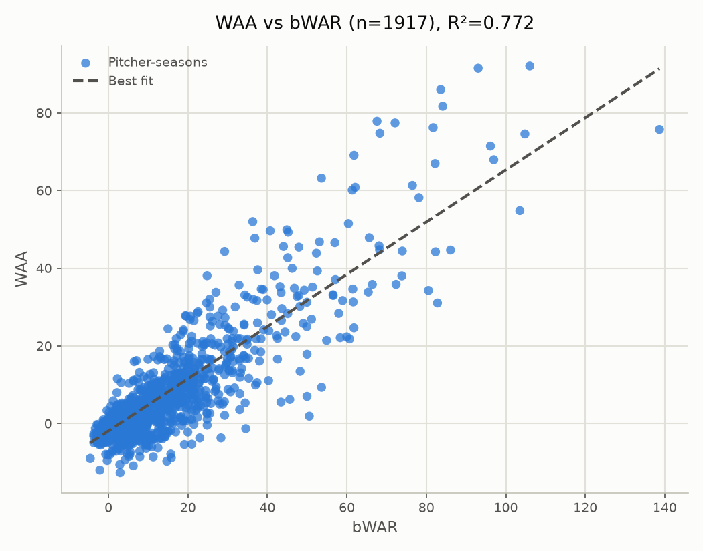

# WAA vs. Accepted WAR: All qualified starters, 1950–2026

- **Scope:** All qualified starters
- **Years evaluated:** 1950–2026 (pooled across the full span)
- **Metric:** WAA (league-average baseline=0.495)
- Source values file: `value_1950-2026_matrix_2000-2025_a0.10.json`
- Matrix: `matrix_2000-2025_a0.10.json` (years=2000-2025, alpha=0.10)

## WAA vs bWAR

- n = 1917 (excluded 0: no bWAR match)
- Pearson r = 0.879, R² = 0.772
- Best fit: WAA = 0.672 × bWAR - 1.857

### Top/bottom 5 by WAA

**Top 5:**

| Pitcher | Season | WAA | bWAR |
|---|---|---|---|
| Tom Seaver | - | +92.041 | +106.02 |
| Gaylord Perry | - | +91.476 | +93.03 |
| Nolan Ryan Jr. | - | +85.993 | +83.60 |
| Steve Carlton | - | +81.732 | +84.11 |
| Jim Palmer | - | +77.867 | +67.57 |

**Bottom 5:**

| Pitcher | Season | WAA | bWAR |
|---|---|---|---|
| Scott Elarton | - | -12.556 | +2.92 |
| Jordan Lyles | - | -11.907 | -2.17 |
| Jose Lima | - | -10.813 | +6.21 |
| Jimmy Haynes | - | -10.499 | +2.84 |
| Bobby Witt | - | -9.630 | +14.67 |

### Top/bottom 5 by bWAR

**Top 5:**

| Pitcher | Season | WAA | bWAR |
|---|---|---|---|
| Roger Clemens | - | +75.754 | +138.67 |
| Tom Seaver | - | +92.041 | +106.02 |
| Greg Maddux | - | +74.599 | +104.79 |
| Randy Johnson | - | +54.840 | +103.52 |
| Phil Niekro | - | +67.956 | +96.96 |

**Bottom 5:**

| Pitcher | Season | WAA | bWAR |
|---|---|---|---|
| Kevin Jarvis | - | -8.906 | -4.60 |
| John Van Benschoten | - | -3.151 | -3.73 |
| Jo-Jo Reyes | - | -4.893 | -3.71 |
| Randy Lerch | - | -2.600 | -3.69 |
| Wade Blasingame | - | -1.237 | -3.32 |

### Largest disagreements (by fit residual)

| Pitcher | Season | WAA | bWAR | Residual |
|---|---|---|---|---|
| Jim Palmer | - | +77.867 | +67.57 | +34.321 |
| Nolan Ryan Jr. | - | +85.993 | +83.60 | +31.675 |
| Warren Spahn | - | +77.434 | +72.11 | +30.837 |
| Gaylord Perry | - | +91.476 | +93.03 | +30.822 |
| Don Sutton | - | +74.781 | +68.29 | +30.751 |
| Kenny Rogers | - | +1.923 | +50.53 | -30.173 |
| Catfish Hunter | - | +52.000 | +36.30 | +29.465 |
| Juan Marichal | - | +69.085 | +61.78 | +29.429 |
| Whitey Ford | - | +63.197 | +53.58 | +29.051 |
| Steve Carlton | - | +81.732 | +84.11 | +27.071 |
