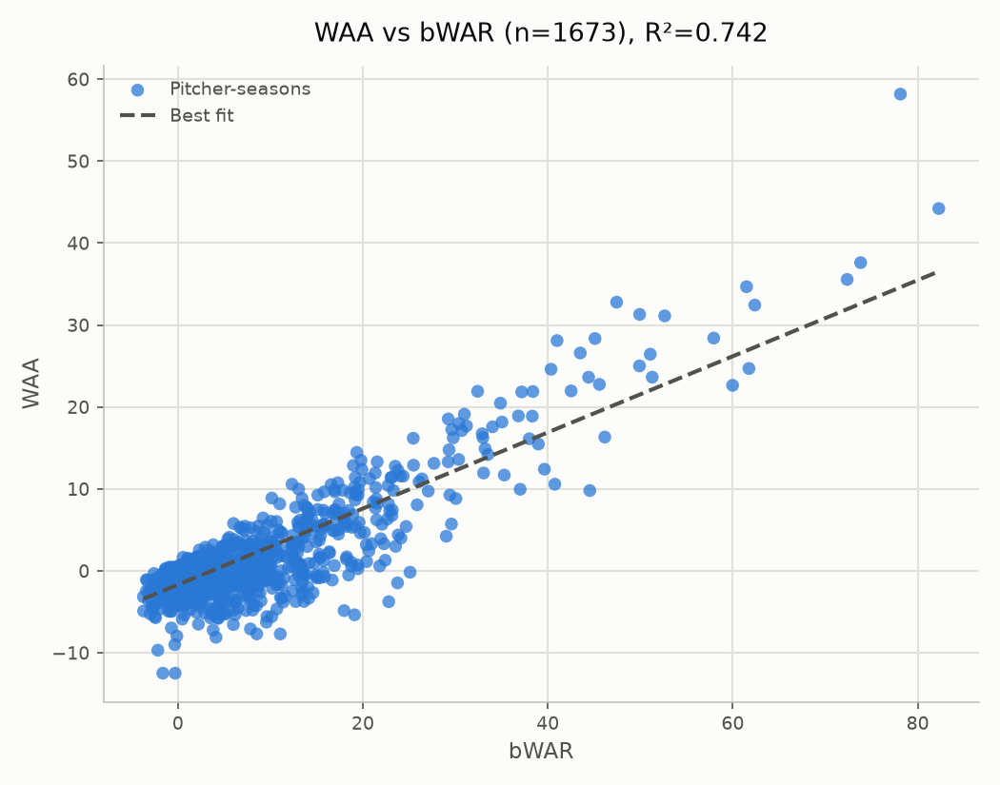

# WAA vs. Accepted WAR: All qualified starters, 2000–2026

- **Scope:** All qualified starters
- **Years evaluated:** 2000–2026 (pooled across the full span)
- Source values file: `value_2000-2026_matrix_2000-2025_a0.10.json`
- Matrix: `matrix_2000-2025_a0.10.json` (years=2000-2025, alpha=0.10, baseline=0.495)

## WAA vs bWAR

- n = 1673 (excluded 0: no bWAR match)
- Pearson r = 0.861, R² = 0.742
- Best fit: WAA = 0.465 × bWAR - 1.682

### Top/bottom 5 by WAA

**Top 5:**

| Pitcher | Season | WAA | bWAR |
|---|---|---|---|
| Clayton Kershaw | - | +58.178 | +78.13 |
| Justin Verlander | - | +44.220 | +82.28 |
| Max Scherzer | - | +37.618 | +73.83 |
| Zack Greinke | - | +35.563 | +72.37 |
| Chris Sale | - | +34.680 | +61.49 |

**Bottom 5:**

| Pitcher | Season | WAA | bWAR |
|---|---|---|---|
| Scott Elarton | - | -12.480 | -0.30 |
| Jose Lima | - | -12.474 | -1.63 |
| Jordan Lyles | - | -9.678 | -2.17 |
| Rob Bell | - | -8.989 | -0.34 |
| Mark Hendrickson | - | -8.103 | +4.12 |

### Top/bottom 5 by bWAR

**Top 5:**

| Pitcher | Season | WAA | bWAR |
|---|---|---|---|
| Justin Verlander | - | +44.220 | +82.28 |
| Clayton Kershaw | - | +58.178 | +78.13 |
| Max Scherzer | - | +37.618 | +73.83 |
| Zack Greinke | - | +35.563 | +72.37 |
| Roy Halladay | - | +32.441 | +62.38 |

**Bottom 5:**

| Pitcher | Season | WAA | bWAR |
|---|---|---|---|
| John Van Benschoten | - | -3.151 | -3.73 |
| Jo-Jo Reyes | - | -4.893 | -3.71 |
| Hayden Penn | - | -2.446 | -3.41 |
| Brandon Maurer | - | -1.063 | -3.40 |
| Esmil Rogers | - | -1.144 | -3.34 |

### Largest disagreements (by fit residual)

| Pitcher | Season | WAA | bWAR | Residual |
|---|---|---|---|---|
| Clayton Kershaw | - | +58.178 | +78.13 | +23.564 |
| Tim Wakefield | - | -3.758 | +22.80 | -12.668 |
| Kyle Freeland | - | -5.357 | +19.10 | -12.548 |
| Jacob deGrom | - | +32.792 | +47.44 | +12.436 |
| Joaquín Benoit | - | -4.847 | +17.97 | -11.512 |
| Darren Oliver | - | -7.691 | +11.07 | -11.152 |
| Kenny Rogers | - | -1.461 | +23.75 | -10.812 |
| Adam Wainwright | - | +28.106 | +41.00 | +10.741 |
| Scott Elarton | - | -12.480 | -0.30 | -10.658 |
| Joe Nathan | - | -0.159 | +25.10 | -10.137 |
