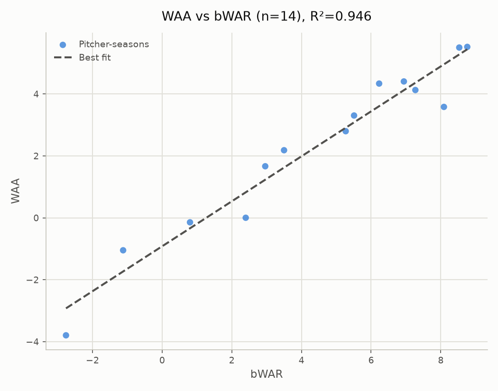

# WAA vs. Accepted WAR: Roy Halladay (MLBAM id 136880), 2000–2026

- **Scope:** Roy Halladay (MLBAM id 136880)
- **Years evaluated:** 2000–2026 (one row per pitcher-season)
- Source values file: `value_2000-2026_matrix_2000-2025_a0.10_pitcher136880_byseason.json`
- Matrix: `matrix_2000-2025_a0.10.json` (years=2000-2025, alpha=0.10, baseline=0.495)

## WAA vs bWAR

- n = 14 (excluded 0: no bWAR match)
- Pearson r = 0.973, R² = 0.946
- Best fit: WAA = 0.726 × bWAR - 0.919

### Top/bottom 5 by WAA

**Top 5:**

| Pitcher | Season | WAA | bWAR |
|---|---|---|---|
| Roy Halladay | 2011 | +5.521 | +8.76 |
| Roy Halladay | 2010 | +5.500 | +8.53 |
| Roy Halladay | 2009 | +4.405 | +6.94 |
| Roy Halladay | 2008 | +4.336 | +6.23 |
| Roy Halladay | 2002 | +4.128 | +7.27 |

**Bottom 5:**

| Pitcher | Season | WAA | bWAR |
|---|---|---|---|
| Roy Halladay | 2000 | -3.794 | -2.76 |
| Roy Halladay | 2013 | -1.048 | -1.12 |
| Roy Halladay | 2012 | -0.144 | +0.80 |
| Roy Halladay | 2004 | +0.002 | +2.40 |
| Roy Halladay | 2001 | +1.666 | +2.96 |

### Top/bottom 5 by bWAR

**Top 5:**

| Pitcher | Season | WAA | bWAR |
|---|---|---|---|
| Roy Halladay | 2011 | +5.521 | +8.76 |
| Roy Halladay | 2010 | +5.500 | +8.53 |
| Roy Halladay | 2003 | +3.582 | +8.09 |
| Roy Halladay | 2002 | +4.128 | +7.27 |
| Roy Halladay | 2009 | +4.405 | +6.94 |

**Bottom 5:**

| Pitcher | Season | WAA | bWAR |
|---|---|---|---|
| Roy Halladay | 2000 | -3.794 | -2.76 |
| Roy Halladay | 2013 | -1.048 | -1.12 |
| Roy Halladay | 2012 | -0.144 | +0.80 |
| Roy Halladay | 2004 | +0.002 | +2.40 |
| Roy Halladay | 2001 | +1.666 | +2.96 |

### Largest disagreements (by fit residual)

| Pitcher | Season | WAA | bWAR | Residual |
|---|---|---|---|---|
| Roy Halladay | 2003 | +3.582 | +8.09 | -1.374 |
| Roy Halladay | 2000 | -3.794 | -2.76 | -0.871 |
| Roy Halladay | 2004 | +0.002 | +2.40 | -0.822 |
| Roy Halladay | 2008 | +4.336 | +6.23 | +0.730 |
| Roy Halladay | 2013 | -1.048 | -1.12 | +0.685 |
| Roy Halladay | 2007 | +2.184 | +3.50 | +0.561 |
| Roy Halladay | 2001 | +1.666 | +2.96 | +0.435 |
| Roy Halladay | 2009 | +4.405 | +6.94 | +0.283 |
| Roy Halladay | 2002 | +4.128 | +7.27 | -0.233 |
| Roy Halladay | 2010 | +5.500 | +8.53 | +0.224 |
