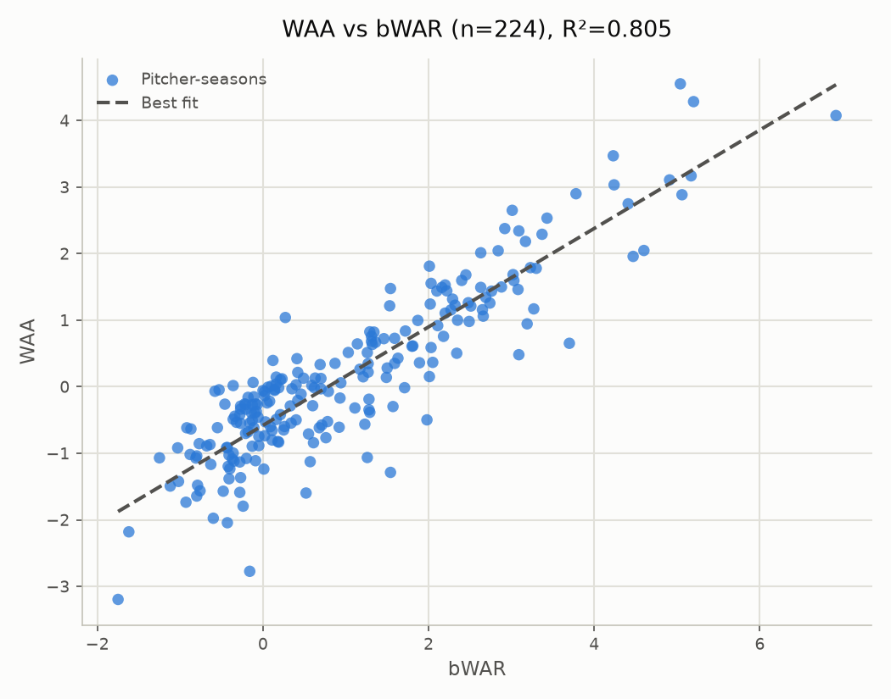

# WAA vs. Accepted WAR: All qualified starters, 2026

- **Scope:** All qualified starters
- **Years evaluated:** 2026 (pooled across the full span)
- **Metric:** WAA (league-average baseline=0.495)
- Source values file: `value_2026_matrix_2000-2025_a0.10.json`
- Matrix: `matrix_2000-2025_a0.10.json` (years=2000-2025, alpha=0.10)

## WAA vs bWAR

- n = 224 (excluded 0: no bWAR match)
- Pearson r = 0.897, R² = 0.805
- Best fit: WAA = 0.740 × bWAR - 0.580

### Top/bottom 5 by WAA

**Top 5:**

| Pitcher | Season | WAA | bWAR |
|---|---|---|---|
| Jacob Misiorowski | - | +4.552 | +5.04 |
| Cam Schlittler | - | +4.284 | +5.20 |
| Cristopher Sánchez | - | +4.075 | +6.92 |
| Chris Sale | - | +3.470 | +4.23 |
| Chase Burns | - | +3.169 | +5.17 |

**Bottom 5:**

| Pitcher | Season | WAA | bWAR |
|---|---|---|---|
| Michael Lorenzen | - | -3.196 | -1.75 |
| Kyle Freeland | - | -2.773 | -0.16 |
| Zac Gallen | - | -2.180 | -1.62 |
| Jeffrey Springs | - | -2.043 | -0.43 |
| Simeon Woods Richardson | - | -1.975 | -0.60 |

### Top/bottom 5 by bWAR

**Top 5:**

| Pitcher | Season | WAA | bWAR |
|---|---|---|---|
| Cristopher Sánchez | - | +4.075 | +6.92 |
| Cam Schlittler | - | +4.284 | +5.20 |
| Chase Burns | - | +3.169 | +5.17 |
| Dylan Cease | - | +2.885 | +5.06 |
| Jacob Misiorowski | - | +4.552 | +5.04 |

**Bottom 5:**

| Pitcher | Season | WAA | bWAR |
|---|---|---|---|
| Michael Lorenzen | - | -3.196 | -1.75 |
| Zac Gallen | - | -2.180 | -1.62 |
| Edward Cabrera | - | -1.068 | -1.25 |
| Grayson Rodriguez | - | -1.492 | -1.12 |
| Ryan Johnson | - | -0.918 | -1.03 |

### Largest disagreements (by fit residual)

| Pitcher | Season | WAA | bWAR | Residual |
|---|---|---|---|---|
| Kyle Freeland | - | -2.773 | -0.16 | -2.075 |
| Aaron Nola | - | -1.287 | +1.54 | -1.846 |
| Sean Burke | - | +0.653 | +3.70 | -1.504 |
| Griffin Jax | - | +1.040 | +0.27 | +1.421 |
| Brady Singer | - | -1.063 | +1.26 | -1.415 |
| Jacob Misiorowski | - | +4.552 | +5.04 | +1.404 |
| Ryan Feltner | - | -1.597 | +0.52 | -1.402 |
| Tomoyuki Sugano | - | -0.497 | +1.98 | -1.382 |
| Michael Lorenzen | - | -3.196 | -1.75 | -1.321 |
| Taj Bradley | - | +0.482 | +3.09 | -1.224 |
