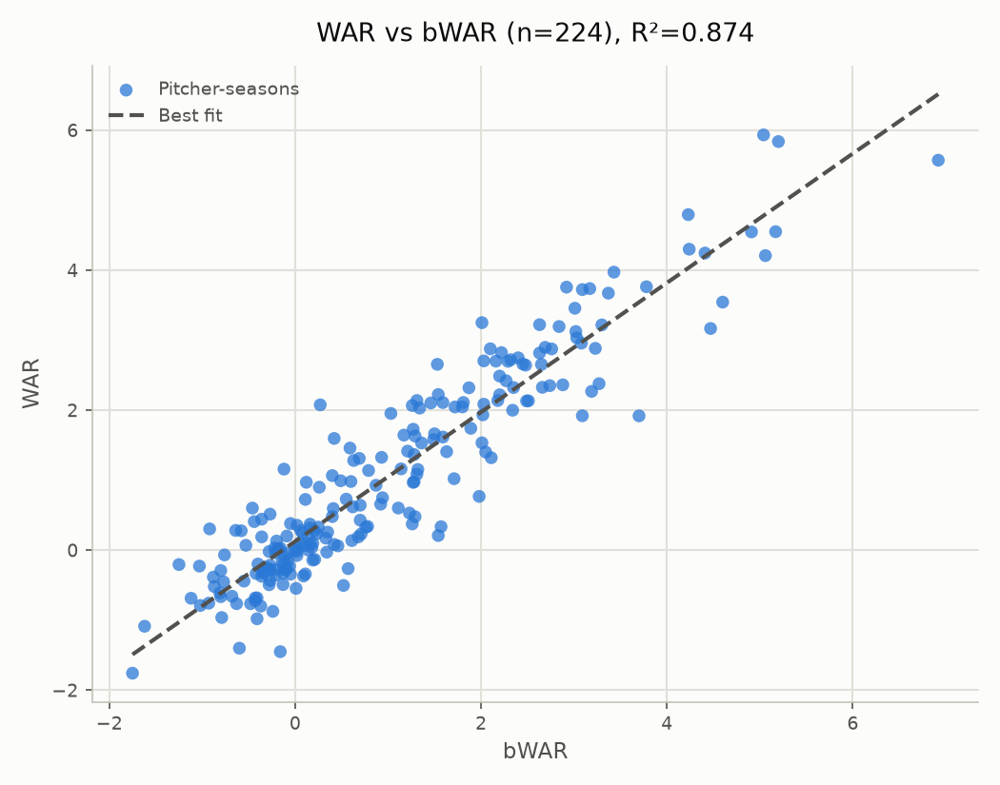

# WAR vs. Accepted WAR: All qualified starters, 2026

- **Scope:** All qualified starters
- **Years evaluated:** 2026 (pooled across the full span)
- **Metric:** WAR (replacement-level baseline=0.437, vs. league-average baseline=0.495) -- an average-or-better start, and more of them, accumulates real value here instead of netting ~0 the way WAA does.
- Source values file: `value_2026_matrix_2000-2025_a0.10_war.json`
- Matrix: `matrix_2000-2025_a0.10.json` (years=2000-2025, alpha=0.10)

## WAR vs bWAR

- n = 224 (excluded 0: no bWAR match)
- Pearson r = 0.935, R² = 0.874
- Best fit: WAR = 0.923 × bWAR + 0.126
- A slope near 1.0 with a small positive intercept would mean this project's replacement-level WAR tracks bWAR on close to a 1:1 scale; compare against the WAA report for the same pitchers to see how much the replacement-level baseline changes that relationship.

### Top/bottom 5 by WAR

**Top 5:**

| Pitcher | Season | WAR | bWAR |
|---|---|---|---|
| Jacob Misiorowski | - | +5.933 | +5.04 |
| Cam Schlittler | - | +5.838 | +5.20 |
| Cristopher Sánchez | - | +5.571 | +6.92 |
| Chris Sale | - | +4.794 | +4.23 |
| Chase Burns | - | +4.550 | +5.17 |

**Bottom 5:**

| Pitcher | Season | WAR | bWAR |
|---|---|---|---|
| Michael Lorenzen | - | -1.757 | -1.75 |
| Kyle Freeland | - | -1.450 | -0.16 |
| Simeon Woods Richardson | - | -1.400 | -0.60 |
| Zac Gallen | - | -1.087 | -1.62 |
| Cristian Javier | - | -0.980 | -0.41 |

### Top/bottom 5 by bWAR

**Top 5:**

| Pitcher | Season | WAR | bWAR |
|---|---|---|---|
| Cristopher Sánchez | - | +5.571 | +6.92 |
| Cam Schlittler | - | +5.838 | +5.20 |
| Chase Burns | - | +4.550 | +5.17 |
| Dylan Cease | - | +4.208 | +5.06 |
| Jacob Misiorowski | - | +5.933 | +5.04 |

**Bottom 5:**

| Pitcher | Season | WAR | bWAR |
|---|---|---|---|
| Michael Lorenzen | - | -1.757 | -1.75 |
| Zac Gallen | - | -1.087 | -1.62 |
| Edward Cabrera | - | -0.205 | -1.25 |
| Grayson Rodriguez | - | -0.687 | -1.12 |
| Ryan Johnson | - | -0.227 | -1.03 |

### Largest disagreements (by fit residual)

| Pitcher | Season | WAR | bWAR | Residual |
|---|---|---|---|---|
| Griffin Jax | - | +2.076 | +0.27 | +1.701 |
| Sean Burke | - | +1.919 | +3.70 | -1.623 |
| Kyle Freeland | - | -1.450 | -0.16 | -1.428 |
| Aaron Nola | - | +0.209 | +1.54 | -1.338 |
| Nolan McLean | - | +3.250 | +2.01 | +1.269 |
| Andrew Alvarez | - | +0.336 | +1.57 | -1.240 |
| Tomoyuki Sugano | - | +0.768 | +1.98 | -1.185 |
| Jacob Misiorowski | - | +5.933 | +5.04 | +1.154 |
| Colin Rea | - | +1.158 | -0.12 | +1.143 |
| Shota Imanaga | - | +2.655 | +1.53 | +1.117 |
